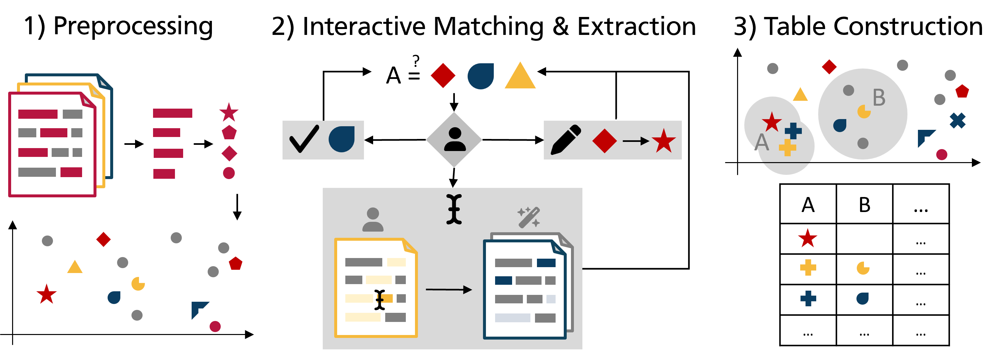

## WannaDB - Interactive Extraction

In previous research, we proposed an interactive system for extracting structured representations but mainly concentrated on the alignment of information nuggets and target cells while assuming that there are off-the-shelf extractors suitable for finding the required nuggets in the text.
With the latest additions to this repository, we are now extending on that, presenting an approach for going beyond these fixed sets of nuggets while leveraging the same feedback for extraction and alignment. 

User feedback can be used to provide ad-hoc domain adaptation and find additional relevant extractions that were missed by the generic extractors before. 
Once a user points the system to a missing extraction (and provides the relevant value by selecting it from the source document), the system should not only consider that custom span as a valid nugget but additionally try to find similar text spans in different documents and add these missing extractions to the vector space. 
Those additional extractions are then new candidates for creating the final structured representation---which supports the exploration of the vector space. 
At the same time, the vector space is leveraged to steer the additional extraction process.

More details can be found in our Paper *Benjamin Hättasch and Carsten Binnig. 2024. More of that, please: Domain Adaptation of Information Extraction through Examples & Feedback. In Workshop on Human-In-the-Loop Data Analytics (HILDA 24), June 14, 2024, Santiago, AA, Chile.*

We implemented a range of custom extractors that can be used to find similar text spans in different documents. The extractors are based on different approaches, such as exact matching, question answering, semantic similarity, and syntactic similarity. 
The implementations can be found in `matching/custom_match_extraction.py`, where the base abstract class `BaseCustomMatchExtractor` is implemented, which provides the structure for all extractors to adapt upon. See below for a full list of all implemented extractors. In `wannadb_api.py`, the extractor that is to be used can be changed by changing the `find_additional_nuggets` attribute of the matching pipeline. For all extractors, the exception being the `FAISS` extractor, a `ParallelWrapper` is provided in `matching/custom_match_extraction.py`. This class can be wrapped around the extractor initialization, which causes the extractor invocation to be designed data-parallel by distributing the remaining documents over a team of threads.

## List of extractors

1. `ExactCustomMatchExtractor`: Based on extracting exact matches to the annotated span from the other documents. Corresponds to the status quo of WannaDB.
2. `VarianceExtractor`: Finds syntactic variances of the given text span.
2. `QuestionAnsweringCustomMatchExtractor`: Prompts the pretrained question answering LLM `deepset/roberta-base-squad2` by asking to extract a similar phrase to that of the selected span. With this, one match for each remaining document is retrieved and is classified as match if the extraction score exceeds a threshold.
3. `WordNetSimilarityCustomMatchExtractor`: Leverages `WordNet`, a semantic and lexical network which captures relationships between concepts, in order to extract semantically similar words to the selected span. To this end, the Wu-Palmer-Similarity between the match and each token of remaining documents is computed, which quantifies the depth of the first common preprocessor w.r.t to the two concepts. If a high similarity is found, a span corresponding to the ngram structure of the input span is extracted around the match.
4. `FaissSemanticSimilarityExtractor`: Extracts semantically and syntactically similar spans to the match using the [FAISS](https://github.com/facebookresearch/faiss) library, allowing for high temporal efficiency, even with a large number of documents and tokens. To this end, the embeddings of every token is computed once and indexed using `FAISS. If an embedding of a single token is found to be similar to the whole query, it is further examined by matching it to the ngram structure of the query. A threshold is used to determine whether a candidate ngram is sufficient to classify it as a match.
5. `SpacySimilarityExtractor`: Similar to the FAISS extractor, this extractor computes the cosine similarity between the custom match to all tokens of remaining documents, and extracting a similar span corresponding to the ngram structure of the query. The main distinction is that a spaCy corpus is used to embed all tokens. **Important**: If this extractor is to be used, the spaCy corpus `en_core_web_md` needs to be loaded beforehand, since the kernel requires a restart. 
6. `NgramCustomMatchExtractor`: An old approach to custom extraction that works similar to the SpacySimilarityExtractor. The main difference is that SBERT is used as an embedding model. However, the inference times are too high to be considered practical.
7. `ForestCustomMatchExtractor`: This extractor is based on the task of regex synthesis, where positive and negative examples of an attribute are used to produce a regex string which can be used to extract syntactically similar spans to the custom span. To this end, [FOREST](https://github.com/marghrid/FOREST) is used and integrated into WannaDB. However, since multiple examples are required for each attribute, and the fact that many attributes lack close syntactic similarity, such synthesizer might not terminate. For this reason, the extractor has been removed from the main branch, but is still preserved on the `sb/forest-extractor` branch.
8. `FaissSentenceSimilarityExtractor`: Semantic similarity extraction using a two stage approach (first sentence, then phrase level) and speed up by FAISS.
9. `VarianceSemanticExtractor`: Combination of `VarianceExtractor`and `FaissSentenceSimilarityExtractor`, to find both syntactic and semantic variants.
