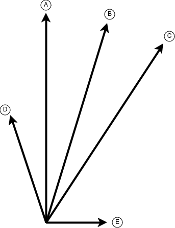
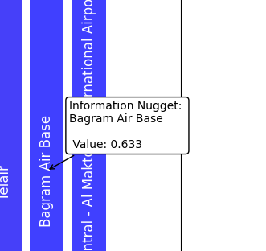

## Hey there!
Before you access the cosine-distance scale, take a moment to read the following tips.
If you are familiar with the metrics used in WANNADB or have gone through this tutorial before,
feel free to exit using the **skip** button.

<!-- section -->

## Cosine Similarity in 2D Plane:
Imagine that you and a friend are standing in the middle of a field, and both of you
point in different directions. Each direction you point is like a piece of information.
The closer your two arms are to pointing in the same direction, the more similar your
thoughts or ideas are.

### Same direction:
If you both point in exactly the same direction, it means your ideas (or pieces of information) are exactly alike.
This is like saying: "We’re thinking the same thing!"

### Opposite direction:
If you point in completely opposite directions, your ideas are as different as they can be. You’re thinking about completely different things.

### Right angle:
If your arms are at a 90-degree angle, you're pointing in different directions, but not as different as pointing in opposite directions. You’re thinking about different things, but there might still be a tiny bit of connection.

<!-- section -->

## Multi Dimensionality of Vectors and Cosine Distance:
Vectors may have more than 2 dimensions, as was the case of you and your friend on the field. The mathematical formula guarantees a value between -1 and 1 for each pair of vectors, for any number of dimensions.

The cosine similarity is equal to 1 when the vectors point at the same direction, -1 when the vectors point in opposite directions, and 0 when the vectors are perpendicular to each other.

As cosine similarity expresses how similar two vectors are, a higher value (in the range from -1 to 1) expresses a higher similarity. In **wanna-db** we use the dual concept of cosine distance. Contrary to cosine similarity, a higher value in the cosine distance metric, means a higher degree of dissimilarity.

_cos-dist(**a**, **b**) = 1 - cos-sim(**a**, **b**)_

<!-- section -->

## Cosine-Driven Choices: Ranking Database Values:
The bar chart shows all nuggets found inside the documents, lined after each other along the x-axis. The y-axis shows the normalized cosine distance. As we mentioned, the lower the cosine distance is, the more certain we are that the corresponding word belongs to what we are looking for: a value in the database.

### QUESTION:
After you explore the bar chart, ask yourself - do the answers on the left tend to be more plausible?

### PRO TIP:
Click on each bar to show the exact value, as well as the full information nugget.

